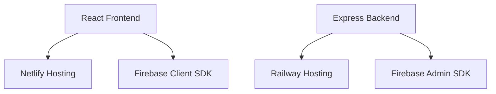

# 🛍️ Final Premium Store

### Modern E-Commerce Web Application

> Final Premium Store is a full-stack e-commerce platform built using React, Vite, Firebase, Express.js, and modern UI technologies. The project is optimized for scalable frontend and backend deployment using Netlify and Railway.

---

# 🌐 Live Demo

## 🔗 Website
https://premiuminfo2.netlify.app/

---

# 📌 Project Overview

This repository contains a split architecture:

```bash
final-premium/
│
├── client/      # React + Vite Frontend
├── server/      # Express + Firebase Backend
├── firebase/    # Firestore Rules & Config
```

The application is designed with:

- ⚡ Fast frontend performance
- 🔥 Firebase integration
- 🛒 Modern e-commerce UI
- 📱 Responsive mobile-first design
- ☁️ Cloud deployment architecture
- 🔐 Secure backend configuration

---

# 🚀 Features

## 🛍️ E-Commerce Functionality
- Product listing
- Product details page
- Shopping cart
- Firebase-powered data storage
- Dynamic UI rendering
- Responsive product layouts

---

## ⚡ Frontend Features
- React + Vite setup
- Fast build optimization
- Lazy loading support
- Responsive design
- Modern UI components
- Optimized deployment with Netlify

---

## 🔥 Backend Features
- Express.js API server
- Firebase Admin integration
- Secure environment variable handling
- REST API architecture
- Railway deployment support

---

# 🛠️ Tech Stack

## Frontend
- React
- Vite
- JavaScript
- CSS
- Firebase Client SDK

## Backend
- Node.js
- Express.js
- Firebase Admin SDK

## Deployment
- Netlify (Frontend)
- Railway (Backend)

---

# 📂 Project Structure

```bash
final-premium/
│
├── client/
│   ├── src/
│   ├── public/
│   ├── package.json
│   └── vite.config.js
│
├── server/
│   ├── routes/
│   ├── controllers/
│   ├── middleware/
│   ├── package.json
│   └── server.js
│
├── firebase/
│   └── firestore.rules
│
├── netlify.toml
├── .gitignore
└── README.md
```

---

# ⚙️ Installation & Setup

## 1️⃣ Clone Repository

```bash
git clone https://github.com/Afzal-gif888/premium-store2.git
cd premium-store2
```

---

# 📦 Frontend Setup

## Install Dependencies

```bash
cd client
npm install
```

## Run Frontend

```bash
npm run dev
```

## Build Frontend

```bash
npm run build
```

---

# 🔥 Backend Setup

## Install Dependencies

```bash
cd server
npm install
```

## Start Backend Server

```bash
npm start
```

---

# ☁️ Deployment

## 🌐 Frontend Deployment — Netlify

The project includes a configured `netlify.toml` file.

### Build Command

```bash
npm run build
```

### Publish Directory

```bash
client/build
```

---

## 🚂 Backend Deployment — Railway

Deploy the `server/` directory separately on Railway.

### Required Environment Variables

```env
PORT=5000
FIREBASE_SERVICE_ACCOUNT=your_json_string
FIREBASE_PROJECT_ID=your_project_id
```

---

# 🔐 Security Notes

- Never commit Firebase service account files
- Store secrets in environment variables
- Use Railway/Netlify secret managers
- `.gitignore` prevents accidental secret exposure

---

# 📱 UI Highlights

- Responsive mobile-first layout
- Modern e-commerce interface
- Clean navigation system
- Fast-loading pages
- Optimized product rendering

---

# ⚡ Performance Optimizations

- Vite build optimization
- Lazy loading
- Efficient API handling
- Optimized deployment pipeline
- Lightweight frontend assets

---

# 📡 Deployment Architecture



---

# 🧠 Future Improvements

- Payment gateway integration
- User authentication
- Admin dashboard
- Order tracking
- Wishlist functionality
- Product filtering & search
- AI-powered recommendations

---

# 🤝 Contribution

Contributions are welcome.

```bash
Fork → Clone → Create Branch → Commit → Push → Pull Request
```

---

# 📜 License

This project is licensed under the MIT License.

---

# 👨‍💻 Developed By

## Afzal

B.Tech Student | Full Stack & AI Enthusiast

Focused on building modern scalable web applications and intelligent systems.

---

# ⭐ Support

If you like this project:

- ⭐ Star this repository
- 🍴 Fork the project
- 🛠️ Contribute improvements

---

# 📬 Contact

## GitHub
https://github.com/Afzal-gif888

## Repository
https://github.com/Afzal-gif888/premium-store2

## Live Website
https://premiuminfo2.netlify.app/
